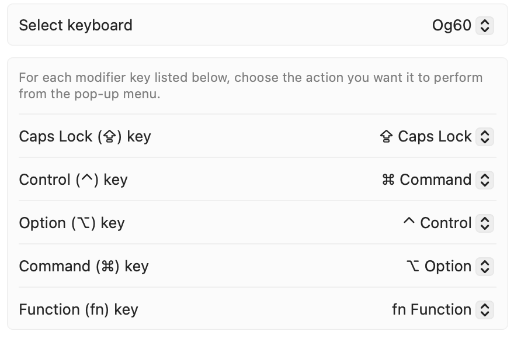

These dotfiles and installation scripts are meant to be cloned in the home directory for quick setup of a new machine and the ability to synchronize configuration. There is some macOS-specific configuration, but this can also be used in Linux environments (just ignore the installation scripts).

The repository uses an inverse `.gitignore` where each file included must be explicitly listed, so nothing will be accidentally added.

-----

## Usage

### Adding the repository to a new system
Create a local repository in the home directory and fetch the files from Github

    cd
    git init
    git remote add origin git@github.com:greyshi/dotfiles.git
    git fetch

**Warning**: The next command will override all the dotfiles in the home directory that are included in the repository. This is meant to run on a fresh install, so this shouldn't be an issue. If there are configurations you want to keep, back them up before running it.

    git switch -f $BRANCH

### Installation scripts
`.macos`: Customizes macOS settings to my preferences. It's based on the one [here](https://github.com/mathiasbynens/dotfiles).

`.brew.sh`: Installs various tools and fonts using [homebrew](https://brew.sh/).

### App Settings
App settings are located in `.appsettings`

### Set Keyboard shortcuts 
In Keyboard settings -> Keyboard Shortcuts -> App Shortcuts
* Select Next Tab
* Select Previous Tab
* Show Previous Tab
* Show Next Tab
* Pin Tab

Also, for your external keyboard set up the key remappings:

Set the mission control hotkeys to switch to left and right spaces as well.

In order to make the transition between spaces instant, go to Accessibility -> Display -> Reduce Motion

### Misc
* Enable three finger drag in trackpad settings
* Disable all notification sounds and pop ups for unimportant apps
* Set alert volume to zero
* Copy over .zsh_history
